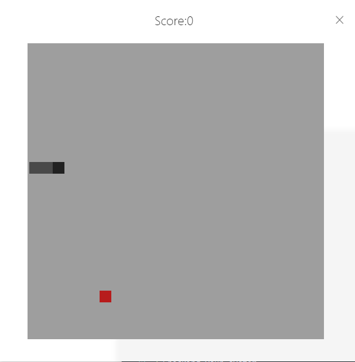

# Online Demo
https://snake.stack42.xyz/

# simple-snake
a simple snake game based on electron

## Screenshot



## To Use
To clone and run this repository you'll need [Git](https://git-scm.com) and [Node.js](https://nodejs.org/en/download/) (which comes with [npm](http://npmjs.com)) installed on your computer. From your command line:

```bash
# install electron-forge
npm i -g @electron-forge/cli
# Clone this repository
git clone https://github.com/littleGabriel/simple-snake.git
# Go into the repository
cd simple-snake
# Install dependencies
npm install
# Run the app
npm start
```


## License

[CC0 1.0 (Public Domain)](LICENSE.md)
